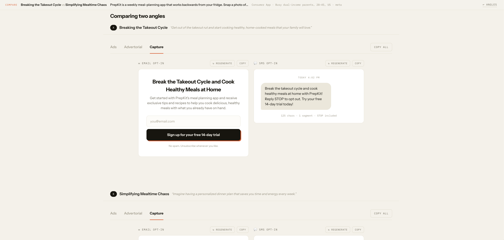

# Campaign in a Box

One offer in, a full campaign starting point out. Paste an offer and an audience, get five distinct marketing angles, pick one, and receive a complete kit built around that angle: ad copy for Meta, Taboola native, and TikTok, a native advertorial pre-lander with a live styled preview, and the email and SMS opt-in copy that feeds the list.

**Live demo:** https://campaign-in-a-box-iota.vercel.app/

Built for the It's Today Media Marketing Development Engineer build challenge.

## What does this tool do?

It turns a single offer into a full campaign starting point. You paste an offer and an audience, it generates five distinct marketing angles, you pick one, and it produces a complete kit built around that angle: ad copy for Meta, Taboola native, and TikTok, a native advertorial pre-lander with a live preview, and the email and SMS opt-in copy that feeds the list. One input, a ready first draft of a whole campaign.

## Why did you build THIS one?

I built this one because the business runs on buying media at scale and turning that traffic into email and SMS lists, and conversion rate optimization and funnel development are two of the four services the company leads with. For a lean team, the slow part is never buying the traffic, it is producing enough distinct creative and matching pre landers fast enough to actually test them. So I built the piece that removes the blank page problem, you give it one offer and it hands you a full, angle consistent kit in one pass, ad copy, a pre lander, and the opt in copy that builds the list the business actually depends on.

I picked this over building another landing page generator on purpose, since the company already builds pages. The real leverage is not one more generator but collapsing the whole path from angle to creative to capture into a single flow, so the team spends its time testing and optimizing winners instead of drafting everything from scratch by hand. The angle is the actual bottleneck in media buying, not the landing page, since most tools already generate pages and almost none generate the strategic reasoning that everything downstream needs to stay consistent with.

## What would you build next if this were your full time job?

- Close the loop with performance data. Pull results back in, CSV first and MCP connectors to the ad platforms later, so the tool learns which angles win and biases future generation toward them.
- One-click deploy the advertorial as a live pre-lander with a real URL and built-in variant testing, so a buyer goes from offer to live testable funnel in minutes.
- A deeper compliance pass. The current heuristic flag scan is a first step (client-side, keyword/pattern based); the real version would be model-assisted and platform-specific so nothing generated risks getting an ad account flagged.
- Persisted, shareable campaign kits so the team can collaborate and reuse what works.

## How to use it

The app walks through three steps: **Offer → Angles → Kit**. The step indicator in the top-right of the header always shows where you are.

### 1. Describe the offer


On the first screen:
- Choose **Describe it** and type (or paste) a description of the product or offer — what it is, what it costs, what makes it worth clicking — or choose **Paste a URL** and drop in a link; the app fetches the page server-side and extracts the offer text for you (if the fetch fails, it asks you to paste the description instead).
- Fill in **Vertical** (pick the closest category from the dropdown) and **Audience** (a short description like "busy parents, 28–45, US").
- Pick the **primary platform** the campaign is aimed at: Meta, Taboola, TikTok, or Google.
- No offer handy? Click **"Load the sample"** below the form to instantly fill in a working example (PrepKit, a meal-planning app) so you can try the tool without writing anything.
- Click **Generate 5 angles →** (disabled until you've entered an offer).

### 2. Pick an angle — or compare two


The app generates five distinct marketing angles — each with a name, an emotional driver (shown as a small colored pill), the slice of the audience it resonates with, and a one-line hook.

- Read through the cards and click the one you want to build the full kit around. A selected card gets an ink border, an orange offset shadow, and a checkmark badge.
- Click the card again to deselect it, or click a different card to switch.
- Once one is selected, a **"Generate the full kit"** button appears fixed at the bottom of the screen — click it to move on.
- Want to weigh two angles against each other instead? Click **"+ Compare"** at the bottom of any two cards (capped at two at a time). The bottom button switches to **"Compare 2 angles →"** — click it to generate both full kits at once.



The comparison view renders both kits **stacked full-width**, each labeled A/B with its angle name and hook, each with its own independent tabs and controls — nothing about a single kit's layout gets squeezed to fit two side by side.

- Need to change the offer? Use the **Edit** link in the sticky bar at the top to go back to the input screen without losing your place.

### 3. Use the kit

The kit view has three tabs:

**Ads** — Meta rendered as a real feed-ad mock (avatar, sponsored label, primary text, image slot, headline/description with character counts), and below it a Google RSA card (8 headlines, 3 descriptions). Taboola renders as a native row with a thumbnail concept, and TikTok as a dark script card with a hook and numbered beats.


**Advertorial** — a full native-article pre-lander rendered from the generated content: headline, subhead, byline, story sections, and a CTA button, styled to actually read like a published article, not raw text. An **Export HTML** button downloads it as a standalone, styled HTML file.


**Capture** — the email opt-in copy (headline, subtext, button) shown as a mini signup form, and the SMS opt-in message shown as a message bubble with character/segment counts.


Every block has its own **Copy** button (turns green with a checkmark for a moment after copying), a **↻ Regenerate** button that re-rolls just that one piece without touching the rest of the kit, and there's a **Copy all** button at the top-right of the tab bar that copies the entire kit as one formatted block of text, ready to paste into a doc or ad platform.

If a block's generated copy trips a heuristic scan for risky phrasing (guarantees, cure claims, unsupported numeric/health/income claims), a small warning pill appears next to its Copy button — hover it to see what was flagged. It's silent when nothing's flagged.

Use **↩ Angles** in the sticky bar to go back and try a different angle without regenerating the offer, or click the logo in the header at any time to start over from a fresh offer.

### If something goes wrong

If generation fails (including if the model gets rate-limited), you'll see a plain-language error card instead of a crash — your offer and chosen angle are not lost. **Retry generation** tries again from wherever you were (angles, kit, or comparison); **Back to angles** / **Back to the offer** lets you back out a step instead.

## Run it locally

```bash
npm install
cp .env.example .env.local   # add your own GROQ_API_KEY (free at console.groq.com)
npm run dev
```

Then open http://localhost:3000.

## Stack

- Next.js (App Router) + TypeScript + Tailwind — one repo, frontend and API together
- Groq API via the OpenAI SDK (`llama-3.3-70b-versatile`, fallback `llama-3.1-8b-instant`)
- Deployed on Vercel, deploying automatically from `main`
- No database, no auth, no paid services

## Architecture

Two LLM calls per run for the core flow, not a dozen:

1. `POST /api/angles` — offer info → 5 angles (one small JSON call)
2. `POST /api/kit` — offer + chosen angle → the entire kit (one structured JSON call)

`POST /api/fetch-offer` optionally fetches a URL server-side and extracts readable text, with paste as the fallback. `POST /api/kit/regenerate` is a third, on-demand call that re-rolls exactly one piece of an existing kit, passing the rest of the kit back as read-only context so the fresh piece stays consistent with it. Comparing two angles runs two `/api/kit` calls in parallel — still one call per angle, not a fan-out.

The advertorial is never generated as raw HTML. The model returns structured content (headline, subhead, sections, cta) and `AdvertorialPreview` renders it into a styled native-article template. That keeps the demo reliable and the preview always well-formed. The HTML export reuses the same structured content, injected into a static template string client-side — the model still never emits markup directly.

The compliance flag scan (`lib/compliance.ts`) is a client-side heuristic regex scan, not a model call — it lowers risk by surfacing likely problem phrasing but doesn't guarantee platform compliance.

## File map

```
/app
  page.tsx                    main UI: form, angle cards, kit view, comparison view, all states
  /api
    /angles/route.ts          POST: offer info -> 5 angles (JSON)
    /kit/route.ts             POST: offer + chosen angle -> full kit (JSON)
    /kit/regenerate/route.ts  POST: offer + angle + existing kit + target -> one regenerated piece
    /fetch-offer/route.ts     POST: fetch URL, extract readable text
/lib
  groq.ts                   Groq client + callLLM() helper with JSON parsing + 1 retry
  prompts.ts                system prompts (angles, kit, single-piece regenerate)
  types.ts                  shared TS types
  sample.ts                 preloaded sample offer + vertical list
  compliance.ts             heuristic scan for risky generated phrasing
  exportAdvertorial.ts      builds a standalone styled HTML file from the advertorial content
/components
  OfferForm.tsx
  AngleCard.tsx             includes the "+ Compare" toggle
  KitView.tsx               tabs: Ads | Advertorial | Capture
  AdvertorialPreview.tsx    styled native-article preview from structured content
  ComplianceBadge.tsx       warning pill shown when the compliance scan flags something
  RegenerateButton.tsx      per-block "regenerate this one piece" control
  CopyButton.tsx
```
