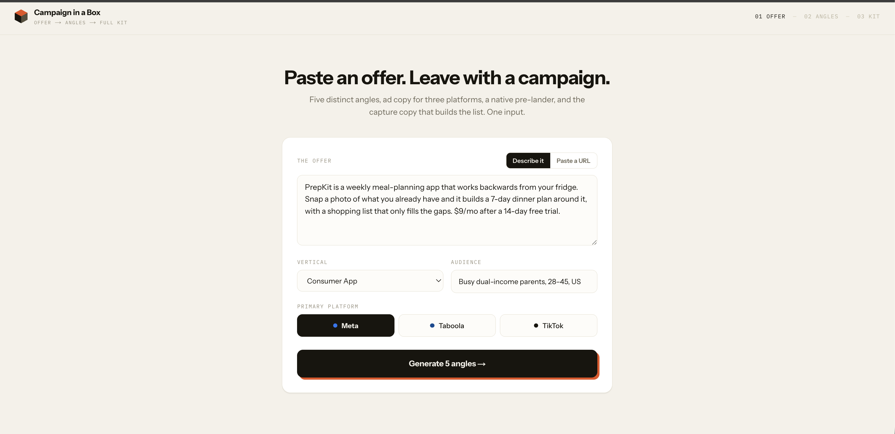
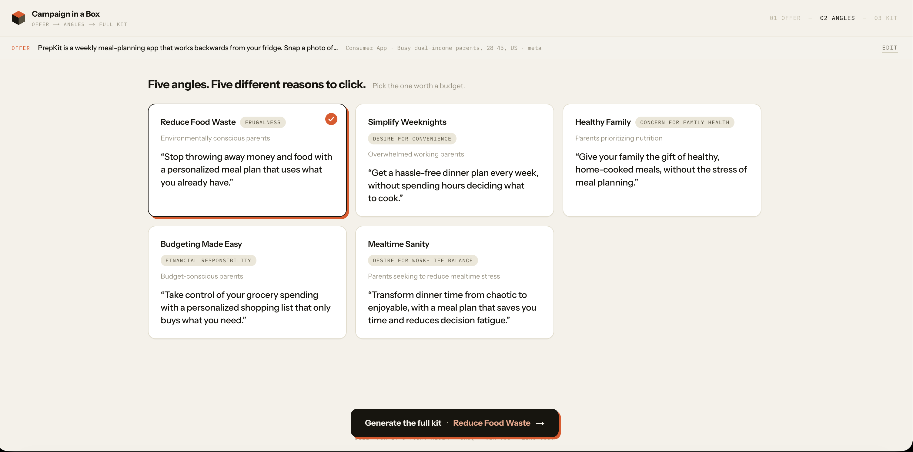
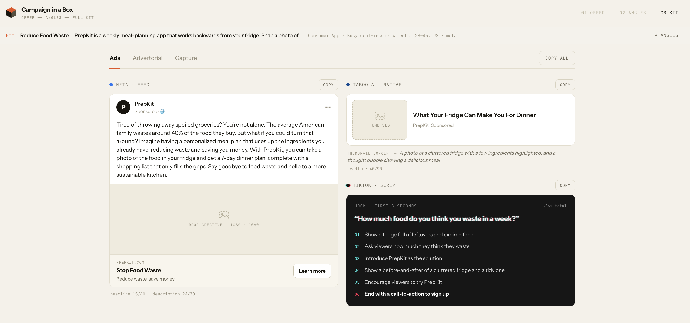
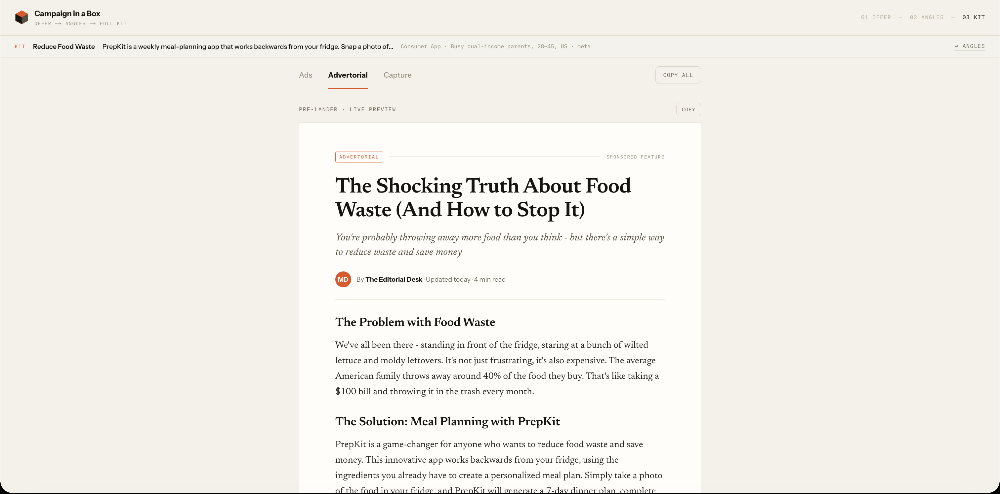
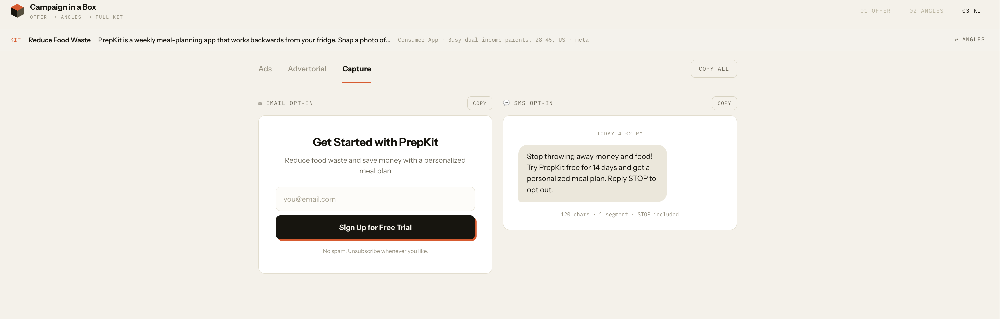

# Campaign in a Box

One offer in, a full campaign starting point out. Paste an offer and an audience, get five distinct marketing angles, pick one, and receive a complete kit built around that angle: ad copy for Meta, Taboola native, and TikTok, a native advertorial pre-lander with a live styled preview, and the email and SMS opt-in copy that feeds the list.

**Live demo:** https://campaign-in-a-box-iota.vercel.app/

Built for the It's Today Media Marketing Development Engineer build challenge.

## What does this tool do?

It turns a single offer into a full campaign starting point. You paste an offer and an audience, it generates five distinct marketing angles, you pick one, and it produces a complete kit built around that angle: ad copy for Meta, Taboola native, and TikTok, a native advertorial pre-lander with a live preview, and the email and SMS opt-in copy that feeds the list. One input, a ready first draft of a whole campaign.

## Why did you build THIS one?

Your business runs on buying media at scale and turning that traffic into email and SMS lists, and conversion rate optimization and funnel development are two of the four services you lead with. For a lean team, the slow part of that loop is not buying the traffic — it is producing enough distinct creative and matching pre-landers to actually test, fast enough to keep up. I built the tool that compresses that first mile. It takes the blank page problem out of launching a new offer and hands a media buyer a full, angle-consistent kit in one pass, including the opt-in copy that builds the list the business depends on.

I picked this over another landing page generator on purpose. You already build pages, so the leverage is not one more generator. It is collapsing the whole angle-to-creative-to-capture step into one flow so the team spends its time optimizing winners instead of drafting everything from scratch. I picked this specific problem because the angle is the actual bottleneck in media buying, not the landing page — most tools already generate pages, almost none generate the strategic reasoning (the angle) that everything downstream depends on being consistent with.

*(This paragraph is a first draft in your voice based on the brief — read it over and adjust anything that doesn't sound like you before this goes in front of judges.)*

## What would you build next if this were your full time job?

- Close the loop with performance data. Pull results back in, CSV first and MCP connectors to the ad platforms later, so the tool learns which angles win and biases future generation toward them.
- One-click deploy the advertorial as a live pre-lander with a real URL and built-in variant testing, so a buyer goes from offer to live testable funnel in minutes.
- A compliance pass so nothing generated risks getting an ad account flagged.
- Persisted, shareable campaign kits so the team can collaborate and reuse what works.

## How to use it

The app walks through three steps: **Offer → Angles → Kit**. The step indicator in the top-right of the header always shows where you are.

### 1. Describe the offer



On the first screen:
- Choose **Describe it** and type (or paste) a description of the product or offer — what it is, what it costs, what makes it worth clicking — or choose **Paste a URL** and drop in a link; the app fetches the page server-side and extracts the offer text for you (if the fetch fails, it asks you to paste the description instead).
- Fill in **Vertical** (pick the closest category from the dropdown) and **Audience** (a short description like "busy parents, 28–45, US").
- Pick the **primary platform** the campaign is aimed at: Meta, Taboola, or TikTok.
- No offer handy? Click **"Load the sample"** below the form to instantly fill in a working example (PrepKit, a meal-planning app) so you can try the tool without writing anything.
- Click **Generate 5 angles →** (disabled until you've entered an offer).

### 2. Pick an angle



The app generates five distinct marketing angles — each with a name, an emotional driver (shown as a small colored pill), the slice of the audience it resonates with, and a one-line hook.

- Read through the cards and click the one you want to build the full kit around. A selected card gets an ink border, an orange offset shadow, and a checkmark badge.
- Click the card again to deselect it, or click a different card to switch.
- Once one is selected, a **"Generate the full kit"** button appears fixed at the bottom of the screen — click it to move on.
- Need to change the offer? Use the **Edit** link in the sticky bar at the top to go back to the input screen without losing your place.

### 3. Use the kit

The kit view has three tabs:

**Ads** — Meta rendered as a real feed-ad mock (avatar, sponsored label, primary text, image slot, headline/description with character counts), Taboola as a native row with a thumbnail concept, and TikTok as a dark script card with a hook and numbered beats.



**Advertorial** — a full native-article pre-lander rendered from the generated content: headline, subhead, byline, story sections, and a CTA button, styled to actually read like a published article, not raw text.



**Capture** — the email opt-in copy (headline, subtext, button) shown as a mini signup form, and the SMS opt-in message shown as a message bubble with character/segment counts.



Every block has its own **Copy** button (turns green with a checkmark for a moment after copying), and there's a **Copy all** button at the top-right of the tab bar that copies the entire kit — ads, advertorial, and capture copy — as one formatted block of text, ready to paste into a doc or ad platform.

Use **↩ Angles** in the sticky bar to go back and try a different angle without regenerating the offer, or click the logo in the header at any time to start over from a fresh offer.

### If something goes wrong

If generation fails (including if the model gets rate-limited), you'll see a plain-language error card instead of a crash — your offer and chosen angle are not lost. **Retry generation** tries again from wherever you were (angles or kit); **Back to angles** / **Back to the offer** lets you back out a step instead.

## Run it locally

```bash
npm install
cp .env.example .env.local   # add your own GROQ_API_KEY (free at console.groq.com)
npm run dev
```

Then open http://localhost:3000.

## Stack

- Next.js (App Router) + TypeScript + Tailwind — one repo, frontend and API together
- Groq API via the OpenAI SDK (`llama-3.3-70b-versatile`, fallback `llama-3.1-8b-instant`)
- Deployed on Vercel, deploying automatically from `main`
- No database, no auth, no paid services

## Architecture

Two LLM calls per run, not a dozen:

1. `POST /api/angles` — offer info → 5 angles (one small JSON call)
2. `POST /api/kit` — offer + chosen angle → the entire kit (one structured JSON call)

`POST /api/fetch-offer` optionally fetches a URL server-side and extracts readable text, with paste as the fallback.

The advertorial is never generated as raw HTML. The model returns structured content (headline, subhead, sections, cta) and `AdvertorialPreview` renders it into a styled native-article template. That keeps the demo reliable and the preview always well-formed.

## File map

```
/app
  page.tsx                 main UI: form, angle cards, kit view, all states
  /api
    /angles/route.ts       POST: offer info -> 5 angles (JSON)
    /kit/route.ts          POST: offer + chosen angle -> full kit (JSON)
    /fetch-offer/route.ts  POST: fetch URL, extract readable text
/lib
  groq.ts                  Groq client + callLLM() helper with JSON parsing + 1 retry
  prompts.ts               system prompts (angles, kit)
  types.ts                 shared TS types
  sample.ts                preloaded sample offer + vertical list
/components
  OfferForm.tsx
  AngleCard.tsx
  KitView.tsx              tabs: Ads | Advertorial | Capture
  AdvertorialPreview.tsx   styled native-article preview from structured content
  CopyButton.tsx
```
